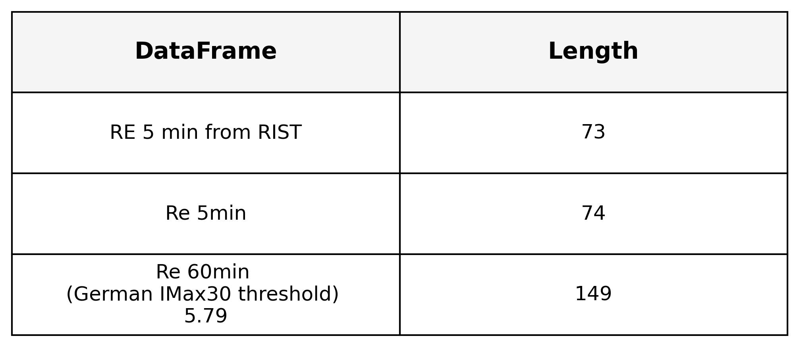
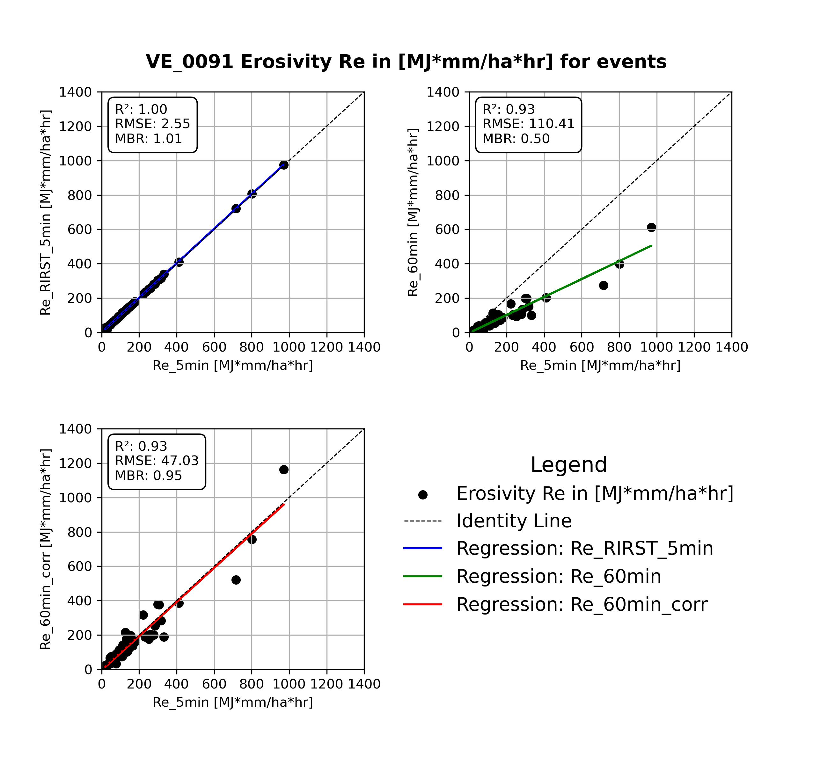

# pyErosivity
Erosivity calculation for example data in 5 min and 60 min temporal resolution.

**Erosivity Re is calculated following methodology in:**
 Rogler, H. and Schwertmann, U.: Erosivität der Niederschläge und Isoerodentkarte Bayerns, J. Rural Engi. Developm., 22, 99–112, 1981. 
 and
 Fischer, F. K., Winterrath, T., & Auerswald, K. (2018). Temporal- and spatial-scale and positional effects on rain erosivity derived from point-scale and contiguous rain data. Hydrology and Earth System Sciences, 22(12), 6505–6518. https://doi.org/10.5194/hess-22-6505-2018

Where Imax30 thresholds to define erosivity event are:
 12.7 mm/h for delta_t=Re_5min (temporal resolution: 5 min)
 5.79 mm/h for delta_t=Re_60min (temporal resolution: 60 min)

 Temporal scaling factor becomes t=1.9 for temporal resolution: 60 min

**Note that we currently define erosivity events only with IMax30 threshold!**
In further work we will also add events where accumulated precipitation during event > than 12.7mm

**Efficiency:** 
 Calculation of erosivity of 5min resolution : 0.32 seconds
 Calculation of erosivity of 60min resolution : 0.13 seconds

# Example results
## Figure 1: Length of Datasets

This figure shows the number of events in erosivity `Re` based on different method and in delta_t 

## Figure 2: Erosivity comparison on same filtered events (N=73)

This figure shows the comparison between erosivity `Re` from observation data `Re_5min_RIST`(delta_t=5 min) by RIST software and `Re_60min` (delta_t=60 min) with respect to `Re_5min` (delta_t=5 min).
delta_t is time incremenet in dataset
