# pyErosivity

A Python package for computing rainfall erosivity (R-factor / EI30) from precipitation time series at any temporal resolution.

## Overview

Rainfall erosivity quantifies the capacity of rain to detach and transport soil, and is the driving force in the USLE/RUSLE family of soil erosion models. pyErosivity implements the full pipeline from raw precipitation data to per-event and annual erosivity statistics:

1. **Event extraction** -- storms are separated by a minimum dry-spell duration (default 6 h, Wischmeier & Smith 1958, 1978) using `get_events`.

2. **Event filtering** -- events shorter than a minimum duration are discarded (`remove_short`).

3. **Per-event metrics** -- for each event and each accumulation window (e.g. 30 min for IMax30), a true sliding-window convolution computes peak accumulated depth and converts it to intensity. Kinetic energy (E_kin) is summed over the event by integrating a rainfall intensity-to-kinetic-energy relationship (here DIN 19708 / Rogler & Schwertmann 1981): higher intensity drops hit harder and carry more energy per unit depth. The erosivity index EI30 is then the product of E_kin and the peak 30-min intensity IMax30. IMax30 acts as a proxy for the storm's hydraulic aggressiveness: two events with the same total depth but different peak intensities have very different erosive power.

4. **Erosivity event selection** -- `get_only_erosivity_events` implements the Wischmeier (1959, 1979) / Wischmeier & Smith (1978) / DIN 19708:2017-08 dual criterion: IMax15 >= 25.4 mm/h (standard) **or** total depth >= 12.7 mm. An alternative formulation using IMax30 >= 12.7 mm/h is also supported. The wider accumulation window makes it looser in practice.

4a. **Optional Renard within-storm splitting** -- `apply_rusle_split` takes the already-filtered erosive events and further splits any storm where a 6-hour window accumulates less than 1.27 mm (Renard et al. 1997 RUSLE rule), then re-applies the erosivity filter. Applying the split after filtering is mathematically equivalent to applying it before, since a sub-event cannot exceed the parent's depth or intensity. It is faster.

5. **Temporal resolution correction** -- for coarser data (e.g. 60-min), IMax30 is underestimated. Williams & Sheridan (1991) first addressed this by equating I30 to the maximum hourly depth for 60-min records. `find_optimal_thr_imax30` generalises this idea by finding the intensity threshold that minimises the difference in event count relative to a high-resolution reference, following Fischer et al. (2018).

6. **Bootstrap uncertainty** -- `bootstrapping_erosivity_60min` and `bootstrapping_erosivity_CPM_60min` estimate uncertainty in annual erosivity by block-bootstrapping over calendar years.

## Output columns

`get_events_values` returns a single DataFrame. Each row is one event; the columns are:

| Column | Description | RUSLE criterion |
|---|---|---|
| `event_start` | Event start timestamp | — |
| `event_end` | Event end timestamp | — |
| `event_depth` | Total accumulated depth over the whole event [mm] | Criterion (i): `event_depth` >= 12.7 mm |
| `event_duration` | Event duration [h] | — |
| `E_kin` | Kinetic energy of the event [kJ m⁻²] | — |
| `imax_5` | Peak 5-min intensity [mm/h], present only if resolution ≤ 5 min | — |
| `imax_10` | Peak 10-min intensity [mm/h], present only if resolution ≤ 10 min | — |
| `imax_15` | Peak 15-min intensity [mm/h], present only if resolution ≤ 15 min | — |
| `imax_30` | Peak 30-min intensity [mm/h] | Alternative criterion (ii): `imax_30` >= 12.7 mm/h |
| `imax_60` | Peak 60-min intensity [mm/h] | — |
| `erosivity_EU` | E_kin × IMax [kJ m⁻² mm h⁻¹], added by `compute_erosivity` | — |
| `erosivity_US` | Same in US units [MJ mm ha⁻¹ h⁻¹] (= erosivity_EU × 10), added by `compute_erosivity` | — |

The dual criterion applied by `get_only_erosivity_events` is `event_depth` >= 12.7 mm **OR** an intensity threshold. Two formulations are supported:

- **Standard RUSLE** (Wischmeier & Smith 1978): `imax_15` >= 25.4 mm/h. This equals 6.35 mm concentrated in 15 min.
- **Alternative** (wider window, looser): `imax_30` >= 12.7 mm/h. This equals the same 6.35 mm spread over 30 min.

## Key references

### Erosivity methodology

- Wischmeier, W. H. & Smith, D. D. (1978). *Predicting Rainfall Erosion Losses.* USDA Agric. Handbook 537.
- Renard, K. G. et al. (1997). *Predicting Soil Erosion by Water (RUSLE).* USDA Agric. Handbook 703.
- Williams, R. G. & Sheridan, J. M. (1991). Effect of rainfall measurement time on EI calculation. *Trans. ASAE*, 34(2), 402-406.
- Fischer, F. K., Winterrath, T. & Auerswald, K. (2018). Temporal- and spatial-scale and positional effects on rain erosivity. *Hydrol. Earth Syst. Sci.*, 22, 6505-6518. https://doi.org/10.5194/hess-22-6505-2018
- DIN 19708:2017-08. Bodenbeschaffenheit — Ermittlung der Erosionsgefährdung von Böden durch Wasser mit Hilfe der ABAG. Beuth Verlag, Berlin.

### Kinetic energy formulas

- Rogler, H. & Schwertmann, U. (1981). Erosivitaet der Niederschlaege und Isoerodentkarte Bayerns. *J. Rural Eng. Developm.*, 22, 99-112. *(log form, European calibration; adopted by DIN 19708)*
- Brown, L. C. & Foster, G. R. (1987). Storm erosivity using idealized intensity distributions. *Trans. ASAE*, 30(2), 379-386. *(exponential form, RUSLE standard)*
- McGregor, K. C., Binger, R. L. & Bowie, A. J. (1995). Erosivity index values for northern Mississippi. *Trans. ASAE*, 38(4), 1039-1047. *(exponential form, RUSLE2)*
- van Dijk, A. I. J. M., Bruijnzeel, L. A. & Rosewell, C. J. (2002). Rainfall intensity–kinetic energy relationships: a critical literature appraisal. *J. Hydrology*, 261(1), 1-23. https://doi.org/10.1016/S0022-1694(02)00020-3 *(review; basis for 76.2 mm/h intensity cap)*

### Recommended readings

The physics connecting raindrop size distributions to rainfall kinetic energy:

- **van Dijk, A. I. J. M., Bruijnzeel, L. A. & Rosewell, C. J. (2002).** Rainfall intensity–kinetic energy relationships: a critical literature appraisal. *J. Hydrology*, 261(1), 1–23. https://doi.org/10.1016/S0022-1694(02)00020-3

  A comprehensive review of R–E_k equations across climates. Shows that kinetic energy per unit depth (e_k) rises with intensity but levels off above roughly 76 mm/h, where drop breakup prevents further growth in median drop size. The widely-used general form is `e_k = 28.3[1 − 0.52 exp(−0.042R)]` (J m⁻² mm⁻¹). pyErosivity uses this cap when applying the Rogler & Schwertmann (1981) / DIN 19708 formula.

- **Uijlenhoet, R. & Stricker, J. N. M. (1999).** A consistent rainfall parameterization based on the exponential raindrop size distribution. *J. Hydrology*, 218, 101–127. https://doi.org/10.1016/S0022-1694(99)00032-3

  Derives a unified set of power-law relationships between rainfall rate, mean drop diameter, fall velocity and kinetic energy flux directly from the exponential raindrop size distribution (Marshall & Palmer 1948 form). The key physical insight: larger drops fall faster and kinetic energy per drop scales as the fifth or sixth power of diameter, so even a modest increase in drop size at higher intensities translates into a large gain in erosive power — until drop breakup sets an upper limit.

## Installation

### 1. Create the conda environment

```bash
conda env create -f environment.yml
conda activate pyErosivity_env
```

### 2. Install pyErosivity in editable mode

From the root of the repository:

```bash
pip install -e .
```

### 3. Run the examples

Example scripts are in the `examples/` folder and must be run from the repo root:

```bash
python examples/01_example_RISTvsPyErosivity_only_Imax30.py
python examples/02_example_depth_vs_imax.py
python examples/03_example_calibration.py
python examples/04_example_bootstrapping.py
```

---

## Example studies

### Study 1: Validation against RIST 3.99

**Script:** `examples/01_example_RISTvsPyErosivity_only_Imax30.py`

The first study validates pyErosivity against RIST 3.99 (Rainfall Intensity Summarization Tool), the official USDA software used to compute erosivity for the official US R-factor maps. RIST is the de-facto reference implementation of RUSLE, so matching it is the natural baseline before exploring any extensions.

**Data:** Station VE_0091, 5-min resolution, 1990–2020 (31 years). The station is located near Kreuzbergpass, Italy (46.652097° N, 12.423971° E), an Alpine site at approximately 1600 m a.s.l.

**RIST configuration: Station and data format**

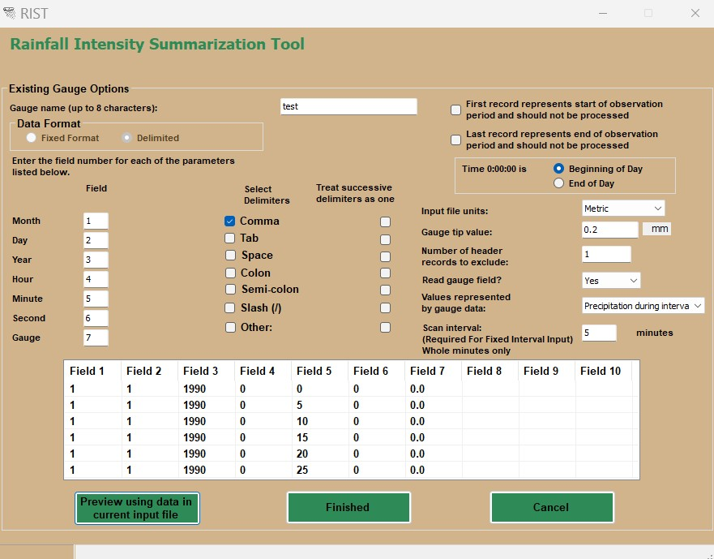

The station is configured with a 5-min scan interval, 0.2 mm gauge tip, metric input, and the DIN 19708 energy formula (`e = 0.119 + 0.0873 log i`). pyErosivity uses the identical formula and the same 6-hour / 1.27 mm storm-break rule.

**RIST erosivity options, standard criterion IMax15 ≥ 25.4 mm/h:**

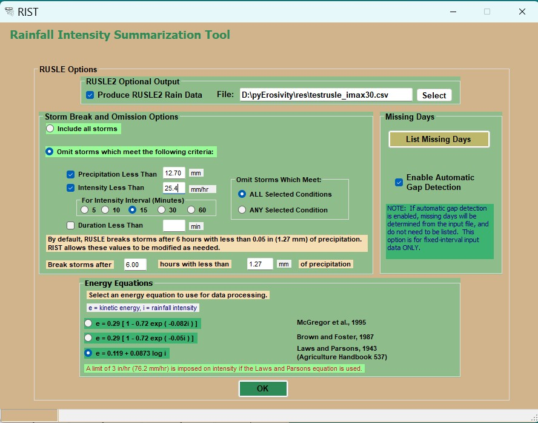

The standard RUSLE dual criterion: an event is kept if `depth >= 12.70 mm` OR `IMax15 >= 25.4 mm/h`. The 25.4 mm/h threshold is derived from the assumption that the marginal erosive event concentrates 6.35 mm (0.25 in) in exactly 15 min. See the discussion in Study 2 below.

**RIST erosivity options, alternative criterion IMax30 ≥ 12.7 mm/h:**

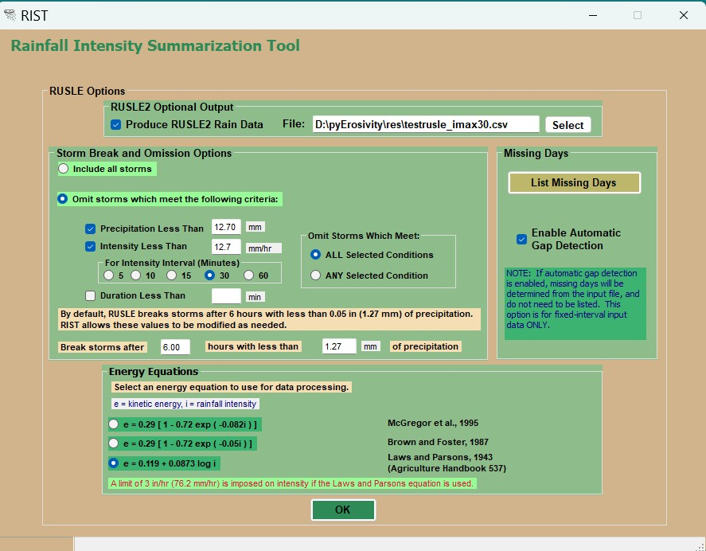

The same dual criterion but using the 30-min accumulation window at 12.7 mm/h. Because the 30-min window is wider, it can capture the same 6.35 mm spread over a longer period. It is a looser filter that selects more events than the IMax15 standard.

**Results:**

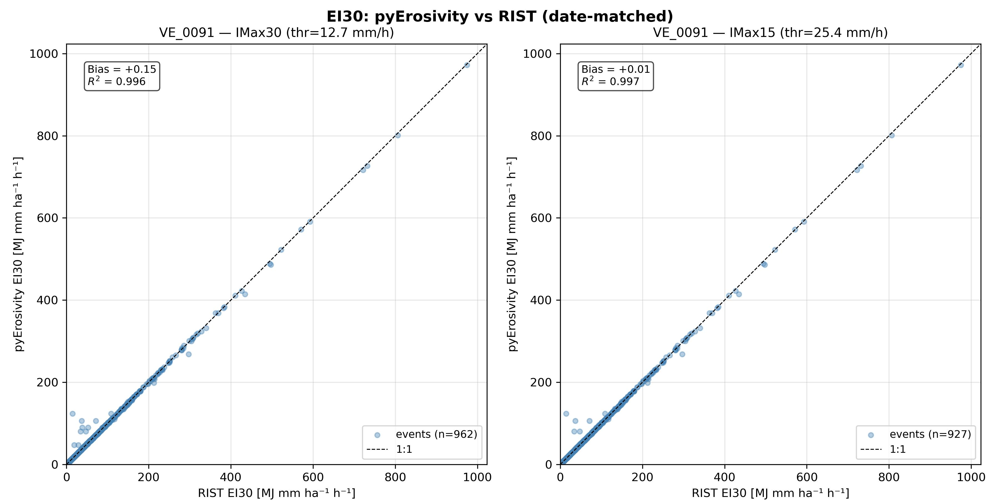

```
Events — IMax30: RIST 962 | pyEr 966
Events — IMax15: RIST 927 | pyEr 931

Mean annual statistics (1990–2020):
                              RIST 30  pyEr 30  RIST 15  pyEr 15
N events / yr                    31.0     31.2     29.9     30.0
Mean event depth [mm]            31.4     31.5     32.3     32.3
Mean event Imax [mm/h]           10.4     10.3     14.0     13.9
R-factor [MJ mm/ha/h/yr]      2027.8   2019.7   1993.0   1985.6
```

pyErosivity produces 4 more events than RIST for both criteria. The gap is fully explained by RIST's internal inch rounding: a depth of 12.8 mm converts to 0.504 in, which RIST rounds to 0.50 in = 12.70 mm. This is exactly at the exclusion threshold, so RIST drops it while pyErosivity keeps it. The four borderline events identified are:

| Criterion | Year | Date | Depth |
|---|---|---|---|
| IMax30 only | 2004 | 2004-05-21 | 8.8 mm |
| IMax30 only | 2014 | 2014-11-17 | 12.8 mm |
| IMax30 only | 2016 | 2016-10-02 | 12.8 mm |
| IMax30 only | 2017 | 2017-09-18 | 12.8 mm |
| IMax15 add. | 2017 | 2017-06-15 | 11.4 mm |

R-factor agreement is within **0.4 %** for both criteria. This study uses the validated 5-min dataset as the reference for all subsequent resolution experiments.

---

### Study 2: Effect of temporal resolution on erosivity

**Script:** `examples/02_example_depth_vs_imax.py`

Study 1 demonstrated that pyErosivity matches RIST at 5-min resolution. But long-term rainfall records are often available only at coarser resolution (15, 30, or 60 min). When the time step grows, the sliding-window intensity estimate degrades. The question becomes: how much does the erosivity estimate change, and can anything be done about it?

#### The core problem: one depth, three different intensities

The figure below shows what happens to the same 6.35 mm rain burst when measured with different accumulation windows:

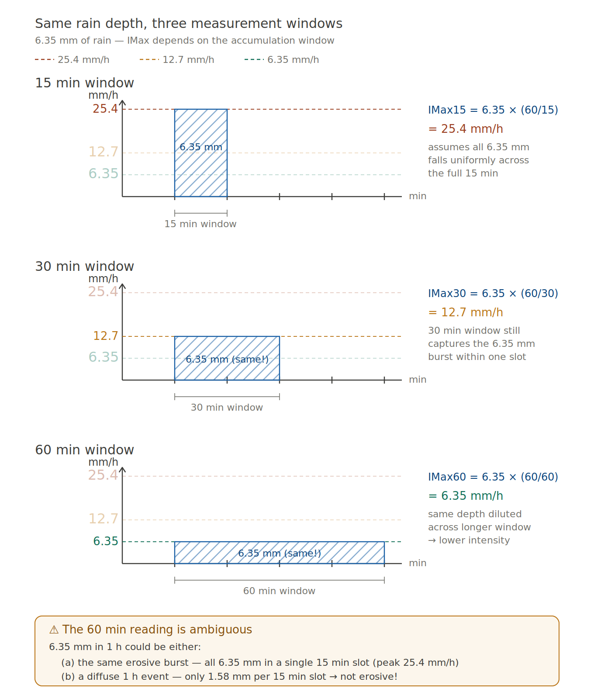

The benchmark depth of 6.35 mm (= 0.25 in, the original RUSLE threshold) gives:

| Window | IMax | Threshold |
|---|---|---|
| 15 min | **25.4 mm/h** | IMax15 ≥ 25.4 mm/h |
| 30 min | **12.7 mm/h** | IMax30 ≥ 12.7 mm/h |
| 60 min | **6.35 mm/h** | IMax60 ≥ 6.35 mm/h |

All three thresholds are derived from the same physical quantity: 6.35 mm concentrated within the accumulation window. IMax15 ≥ 25.4 mm/h is the standard RUSLE criterion; IMax30 ≥ 12.7 mm/h is an alternative with a wider window. At coarser resolution, the sliding window may straddle two fixed time bins, so the measured peak intensity drops even if the actual rainfall was identical.

#### A second problem: temporal aggregation changes event counts

Beyond intensity underestimation, coarsening the time step also affects how storms are *detected*:

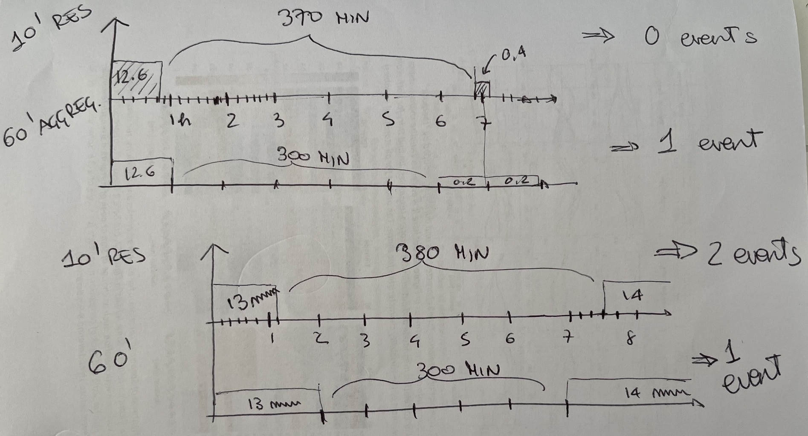

The hand sketch illustrates two scenarios. Both arise because rainfall does not align neatly with fixed hourly clock bins.

In the **top case** a short intense burst is visible at fine resolution. The burst straddles a clock-bin boundary, so at 60-min aggregation it is spread across two consecutive bins. Neither bin reaches the intensity threshold. The dry-spell gap between the bins may also be long enough to trigger the 6-hour event-separation rule, producing a phantom dry interval where none existed. A storm that the fine-resolution data would identify unambiguously registers as **0 events** at hourly resolution.

In the **bottom case** two distinct storms are separated by a dry spell of, say, 370 minutes in the fine-resolution record. When the data are aggregated to 60 min the bin boundaries may land such that the apparent gap between the storms shrinks. The light rainfall on either edge of the dry spell is absorbed into adjacent hourly bins, pulling the measured inter-storm gap below the 6-hour separation threshold. What were **2 events** merge into **1**.

Temporal aggregation can therefore both lose events (by smearing an intense burst across bin boundaries) and create spurious merges (by absorbing marginal dry-spell rain into adjacent bins). The net effect on event count is not predictable without running the full pipeline on the aggregated data.

#### Three criteria compared across four resolutions

To quantify these effects, three selection criteria are run on data resampled to 5, 15, 30, and 60 min:

| Label | IMax column | Threshold | Rationale |
|---|---|---|---|
| **IMax15 ≥ 25.4** | `imax_15` (5/15 min), `imax_30` / `imax_60` (≥30 min) | 25.4 mm/h | Standard RUSLE criterion: 6.35 mm in 15 min |
| **IMax30 ≥ 12.7** | `imax_30` | 12.7 mm/h | Alternative (wider window, looser), validated vs RIST in Study 1 |
| **IMax30 ≥ 25.4** | `imax_30` | 25.4 mm/h | Stricter variant: standard depth applied to the 30-min window |

EI30 is always computed as `E_kin × IMax30` regardless of which column drives the selection. The selection criterion and the energy calculation are independent.

For the 60-min case an **optimised threshold** is also computed: `find_optimal_thr_imax30` finds the IMax60 cut-off that reproduces the 5-min event count (31.2 ev/yr), yielding **6.8 mm/h**.

#### Overview: event classification across all resolutions and criteria

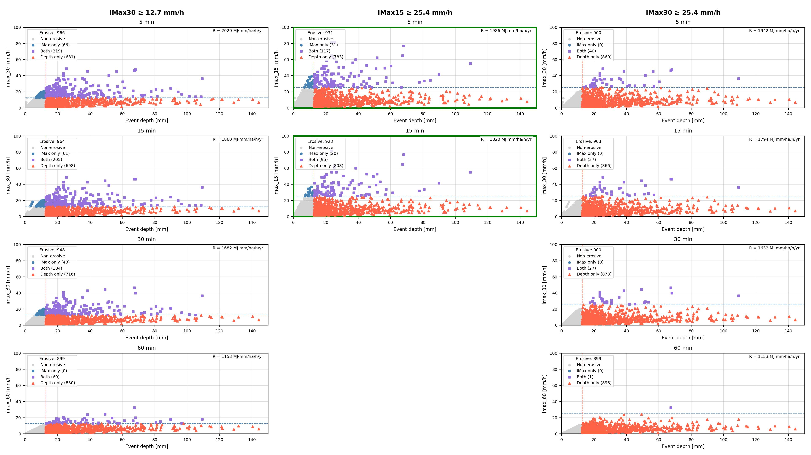

Each panel plots event depth (x) vs peak intensity (y). Colours mark event classification: IMax-only (intensity criterion alone), both (dual criterion), and depth-only (depth criterion alone). The IMax15 column (green border) is the standard RUSLE criterion at 25.4 mm/h. The dashed horizontal line marks the active intensity threshold; the dashed vertical line marks the 12.7 mm depth threshold.

#### Event counts and R-factor by resolution

Summary table: mean annual statistics

```
              Total ev/yr  Erosive ev/yr  IMax only  Both   Depth only  R-factor [MJ mm ha⁻¹ h⁻¹ yr⁻¹]
5 min               137.7           31.2        2.1   7.1        22.0                            2019.7
15 min              138.5           31.1        2.0   6.6        22.5                            1860.2
30 min              139.8           30.6        1.5   5.9        23.1                            1682.1
60 min              143.1           29.0        0.0   2.2        26.8                            1152.9
60 min (opt)        143.1           31.2        2.2  11.3        17.7                            1188.4

IMax15 criterion:
5 min               137.7           29.8        1.0   3.8        25.1
15 min              138.5           29.8        0.6   3.1        26.1
30 min              139.8           29.0        0.0   0.9        28.1
60 min              143.1           29.0        0.0   0.0        29.0
```

Key observations:
- At 60-min resolution the IMax-only zone completely empties for both 12.7 and 25.4 mm/h thresholds. This is a logical consequence of the dual criterion: any event that surpasses a 60-min intensity of 12.7 mm/h (= 12.7 mm in one hour) already satisfies the 12.7 mm depth criterion, so it lands in the "both" or "depth-only" zone, never in "IMax-only". The intensity criterion adds no additional events at hourly resolution regardless of the threshold value, and **R-factor drops by 43 %** relative to 5-min.
- The optimised threshold recovers the correct event count but the R-factor gain is modest (+3 %) because the IMax60 used in EI30 is itself underestimated. Threshold calibration fixes *selection bias* but not the *within-event intensity bias*.
- IMax15 at 25.4 mm/h (standard RUSLE) selects fewer events than IMax30 at 12.7 mm/h (alternative) at fine resolution. The wider 30-min window allows the same 6.35 mm to arrive more slowly, making it a looser filter.

The threshold calibration workflow is covered in detail in Study 3 below. It finds the optimal IMax60 cut-off that recovers the 5-min event count.

---

### Study 3: Threshold calibration and scaling factor correction

**Script:** `examples/03_example_calibration.py`

Study 2 showed that at 60-min resolution the R-factor can drop by 43 % even when the event count is partially recovered by threshold calibration. The root cause is a two-part problem:

1. **Event selection bias:** the dual criterion is `event_depth >= 12.7 mm OR IMax60 >= 12.7 mm/h`. Because any hourly depth that meets the intensity threshold automatically also meets the depth threshold, the IMax-only zone is logically empty at hourly resolution. All selected events come from the depth criterion alone. Events that are short and intense, the ones that would trigger the intensity branch at fine resolution, are either missed entirely or absorbed by clock-bin aggregation before they can reach 12.7 mm in a single hour.
2. **Intensity underestimation bias:** even for events that *are* selected, the 60-min window smears the peak intensity, so EI30 is systematically lower than the 5-min truth even for the exact same storm.

Study 3 addresses both in a clean workflow. IMax15 ≥ 25.4 mm/h is used as the reference criterion because it is the original RUSLE criterion (ii), the standard against which any coarser-resolution estimate should be calibrated.

#### Pipeline

**Step 1: 5-min reference (IMax15 ≥ 25.4 mm/h)**

The standard RUSLE criterion on fine-resolution data gives the ground truth: **31.2 ev/yr**, R-factor **~1934 MJ mm ha⁻¹ h⁻¹ yr⁻¹**.

**Step 2: 60-min naive (IMax60 ≥ 12.7 mm/h)**

The same dual criterion applied to hourly aggregates. The intensity zone empties and R-factor drops to ~**1123 MJ mm ha⁻¹ h⁻¹ yr⁻¹** (-42 %).

**Step 3: 60-min calibrated (optimal IMax60 threshold)**

`find_optimal_thr_imax30` sweeps every unique IMax60 value and finds the threshold that minimises the gap to the reference event count. The optimal threshold (~6.8 mm/h) restores the correct number of erosive events per year (~31.2 ev/yr) but the R-factor only recovers to ~**1142 MJ mm ha⁻¹ h⁻¹ yr⁻¹** (+2 % over naive) because the intensity underestimation bias remains.

#### Event classification at all three stages

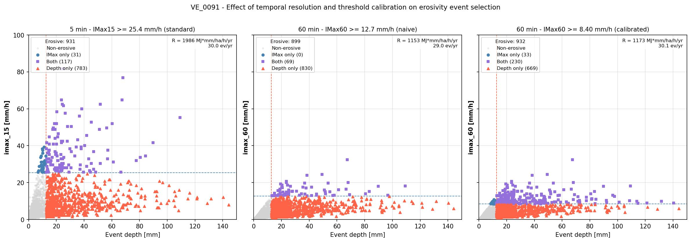

Each panel shows event depth (x) vs peak intensity (y). The same colour scheme as Study 2 is used throughout: steelblue = IMax-only, mediumpurple = both criteria, tomato = depth-only, lightgrey = non-erosive. Note how the IMax-only zone (steelblue) is populated in the 5-min panel and the calibrated panel but completely empty in the naive 60-min panel. The naive 12.7 mm/h threshold is logically unreachable for IMax-only events at hourly resolution.

#### Scaling factor correction

Recovering the event count alone is not enough. The systematic intensity underestimation means EI30 remains biased. Two multiplicative scaling factors are computed to quantify and remove this remaining bias:

**SF-R (annual R-factor approach):** pair reference and target year by year (31 scatter points), compute SF = mean(R_ref_annual) / mean(R_target_annual). Works entirely at the R-factor level; no event matching required.

**SF-EI (per-event EI approach):** match events by start date (inner join), compute SF = mean(EI_ref_matched) / mean(EI_target_matched). Works inside the event population and captures within-event intensity bias directly.

Both SFs are then applied to bring the 60-min R-factor into agreement with the 5-min reference.

#### Before / after correction

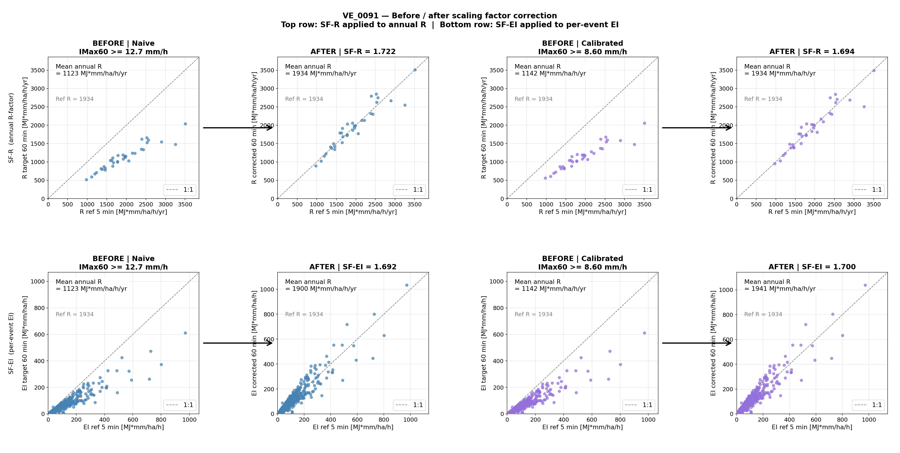

The figure shows 2 rows x 4 columns. Each row covers one SF approach; within each row the left pair is the naive run and the right pair is the calibrated run. The dashed 1:1 line is the target; the arrow marks the before to after correction. After applying the appropriate SF, mean annual R aligns with the 5-min reference for both approaches and both threshold settings.

Key observations:
- SF-R and SF-EI give similar but not identical correction factors. SF-R averages over years while SF-EI averages over matched events, so the two are sensitive to different aspects of the year-to-year variability.
- For the calibrated threshold the SF is smaller than for the naive run because threshold calibration already removes part of the selection bias. The remaining bias is purely the intensity underestimation inside each event.
- After correction, both the naive and calibrated runs converge to the same mean annual R, confirming that the SF approach successfully decouples the selection bias from the intensity bias.

---

### Study 4: Bootstrap uncertainty and OBS vs CPM comparison

**Script:** `examples/04_example_bootstrapping.py`

Studies 1 to 3 established how to derive a bias-corrected hourly erosivity estimate from gauge observations. Study 4 addresses two further questions. First, how uncertain is the mean annual R-factor given a finite record length? Second, how does a convection-permitting climate model (CPM) compare to the observed erosivity when the same bias-correction pipeline is applied?

#### Datasets

**OBS:** Station VE_0091, 1-hour gauge observations, 1990–2020 (31 years). The same station described in Study 1 (near Kreuzbergpass, Italy, 46.652° N, 12.424° E, ~1600 m a.s.l.).

**CPM:** ETH convection-permitting model, historical run, 1996–2005 (10 years). See Dallan et al. (2023, 2024) for details on the simulation and its known biases at Alpine stations.

#### Calibration transfer

The intensity threshold and scaling factor derived in Study 3 from OBS 5-min vs OBS 1h are transferred directly to the CPM. This is the simplest assumption: the temporal resolution bias is a property of the accumulation window, not of the dataset. A second calibration is then performed with the CPM data itself as the target, finding a CPM-own threshold and SF against the 5-min OBS reference over the overlapping 1996–2005 period. This gives three configurations for comparison:

| Configuration | Threshold | SF | Description |
|---|---|---|---|
| OBS | calibrated from OBS | from OBS | Observed erosivity, bias-corrected |
| CPM OBS-cal | same as OBS | same as OBS | CPM with OBS calibration transferred |
| CPM CPM-cal | calibrated from CPM | from CPM vs 5-min ref | CPM with its own threshold and SF |

#### Wet bias diagnostic

Before any event extraction, mean annual total precipitation is computed for each dataset. A large wet bias in the CPM (found to be approximately +95% at this station relative to OBS) indicates that the model generates roughly twice the observed annual rainfall. This is consistent with the known positive precipitation bias of some CPM configurations at Alpine sites (Dallan et al. 2024, who report ~55% bias in 24-hour mean annual maxima at this station). The wet bias propagates directly into the erosivity pipeline: more rainfall means more events exceeding the 12.7 mm depth criterion, leading to a higher erosive event count and R-factor even after threshold calibration.

#### Classification scatter

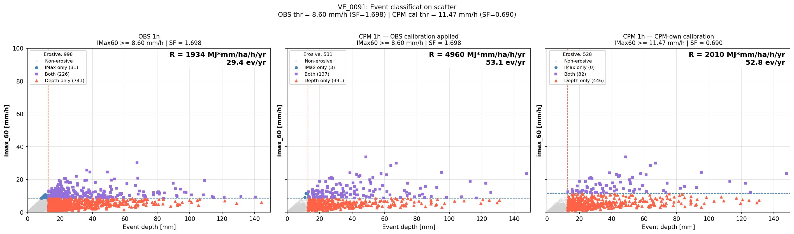

Three panels show the event depth vs IMax60 classification for each configuration. The OBS panel and the CPM OBS-cal panel use the same threshold line; the CPM CPM-cal panel uses the CPM-own threshold. Each panel annotates the resulting mean annual R-factor and event count directly. The comparison immediately reveals whether the elevated CPM event count comes from the depth-only zone (depth criterion triggered by the wet bias) or from the intensity zone.

#### Bootstrap uncertainty

Bootstrap resampling draws calendar years with replacement (1000 iterations). For OBS the sample pool is 31 years; for CPM it is 10 years. The CPM bootstrap uses a pre-defined year-draw sequence (`randy.txt`) shared across ensemble members so that results from different model runs are directly comparable (Dallan et al. 2023).

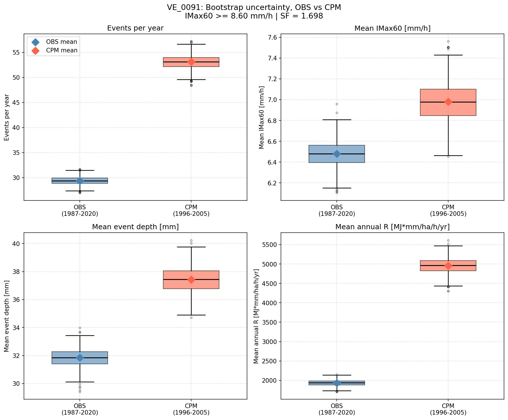

Four statistics are shown as side-by-side boxplots: events per year, mean IMax60, mean event depth, and mean annual R-factor. The diamond marker inside each box is the population mean for the full record. The width of each box reflects sampling uncertainty given the available record length. The shorter CPM record (10 years) produces wider boxes than the 31-year OBS record.

Key observations:
- Sampling uncertainty for the 10-year CPM record is substantially larger than for the 31-year OBS record. A single anomalous year has much more influence on the 10-year mean.
- Transferring OBS calibration parameters to CPM does not remove the wet-bias-driven event inflation. The CPM CPM-cal configuration, which finds its own threshold and SF, converges to a corrected R-factor close to the 5-min OBS reference over the 1996–2005 window, but the event count and depth distributions remain affected by the model's precipitation climatology.
- The comparison highlights that threshold calibration and SF correction address temporal resolution bias but do not replace a full bias correction of the underlying precipitation field.

#### References

- Dallan, E., Marra, F., Fosser, G., Marani, M., Formetta, G., Schär, C., and Borga, M. (2023). How well does a convection-permitting regional climate model represent the reverse orographic effect of extreme hourly precipitation? *Hydrol. Earth Syst. Sci.*, 27, 1133–1149. https://doi.org/10.5194/hess-27-1133-2023
- Dallan, E., Borga, M., Fosser, G., Canale, A., Roghani, B., Marani, M., & Marra, F. (2024). A method to assess and explain changes in sub-daily precipitation return levels from convection-permitting simulations. *Water Resources Research*, 60, e2023WR035969. https://doi.org/10.1029/2023WR035969
